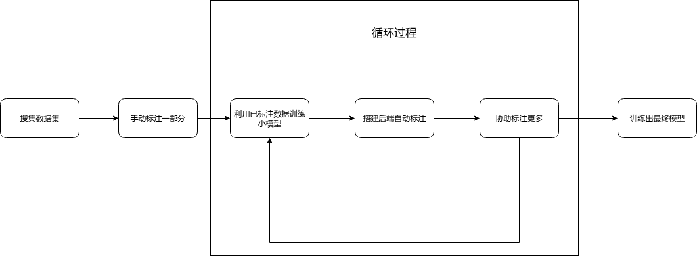
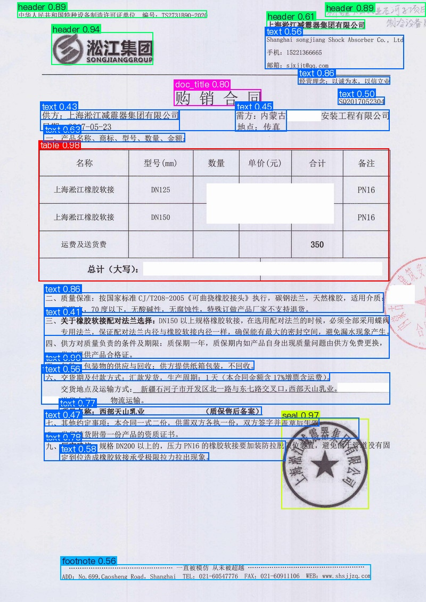
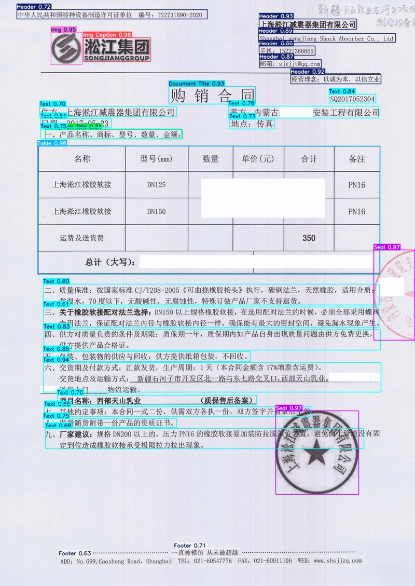
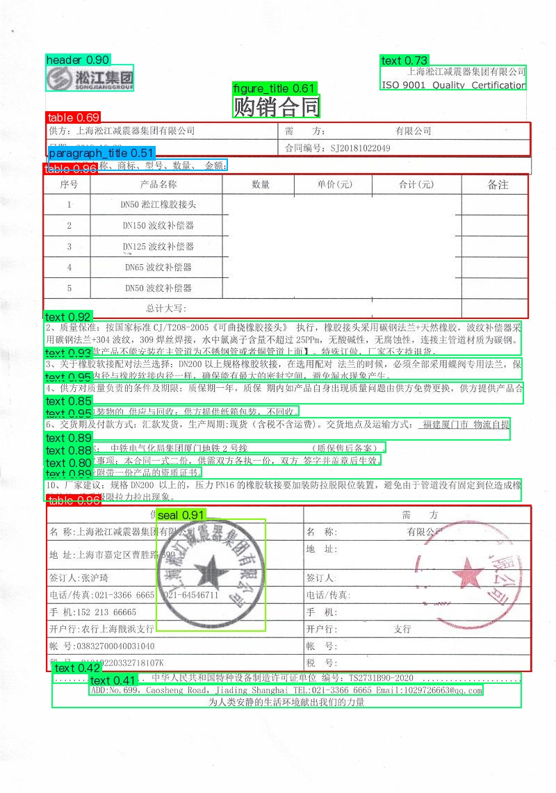
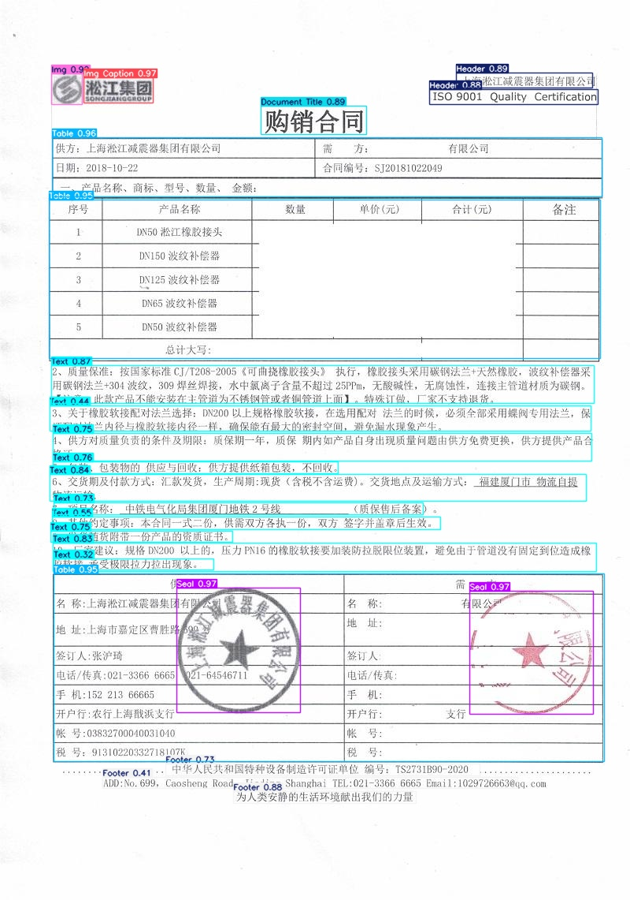

# YOLO-based-Document-Detection-AI

[](https://python.org)
[](https://developer.nvidia.com/cuda-toolkit)
[](LICENSE)

专注于YOLOv10、v11和v12在文档检测中的用途，以及成果分析

## 🎯 项目概述

这是一个基于YOLOv10、YOLOv11和YOLOv12的文档检测AI项目，专注于文档中各种元素的识别和定位。项目提供了完整的训练、预测和可视化解决方案，包括数据集准备、模型训练、预测推理以及Web界面展示功能。

### ✨ 主要功能

- **🚀 模型训练**: 支持YOLOv10、v11和v12版本的模型训练
- **🔍 目标检测**: 对文档中的多种元素进行检测和分类
- **📝 数据标注**: 提供基于Label Studio的半自动标注工具
- **🌐 Web界面**: 提供基于Flask的Web应用，支持上传图片并展示检测结果

### 📋 检测类别

项目可以识别以下13种文档元素：

| 类别 | 中文名称 |
|------|----------|
| Abandon | 废弃 |
| Document Title | 文档标题 |
| Footer | 页脚 |
| Footnote | 脚注 |
| Header | 页眉 |
| Img | 图片 |
| Img Caption | 图片说明 |
| Page Number | 页码 |
| Paragraph Title | 段落标题 |
| Seal | 印章 |
| Table | 表格 |
| Table Caption | 表格说明 |
| Text | 文本 |

## 📁 项目结构

```
YOLO-based-Document-Detection-AI/
├── dataset/                    # 数据集相关文件
│   ├── 训练/                   # 训练数据集(按数量分类)
│   ├── contract_images_baidu/  # 百度合同图片
│   ├── data/                   # 示例图片数据
│   ├── 分类训练集和验证集.py    # 数据集划分脚本
│   ├── 格式化文件名称.py       # 文件名格式化脚本
│   └── back.py                 # Label Studio后端脚本
├── markdown/                   # 项目文档和图片
├── PCweb/                      # Web应用
│   ├── vision.py               # Flask应用主文件
│   └── templates/              # HTML模板
├── yolov10/                    # YOLOv10相关代码
├── yolov11/                    # YOLOv11相关代码
└── yolov12/                    # YOLOv12相关代码
```

## 🛠️ 环境配置

### 系统要求
- Python 3.11.11
- CUDA 12.6 (用于GPU加速)

### 依赖安装

1. **创建虚拟环境**:
```bash
conda create -n yolo python=3.11
conda activate yolo
```

2. **安装基础依赖**:
```bash
pip install ultralytics
```

3. **安装PyTorch** (根据CUDA版本):
```bash
pip3 install -U torch torchvision --index-url https://download.pytorch.org/whl/cu126
```

4. **验证GPU激活**:
```python
import torch
torch.cuda.is_available()  # 应返回True
```

5. **安装标注工具**:
```bash
pip install label-studio label-studio-ml ultralytics opencv-python
```

## 🚀 快速开始

### 数据准备

1. **数据集划分**:
使用`dataset/分类训练集和验证集.py`脚本将数据集划分为训练集(80%)和验证集(20%):
```bash
python dataset/分类训练集和验证集.py
```

2. **数据配置**:
修改对应版本目录下的`data.yaml`文件，配置数据路径和类别信息:
```yaml
train: /dataset/train
val: /dataset/val
nc: 13
names: ['Abandon','Document Title','Footer','Footnote','Header','Img','Img Caption','Page Number','Paragraph Title','Seal','Table','Table Caption','Text']
```

### 模型训练

以YOLOv11为例:
```bash
python yolov11_train.py --data data.yaml --epochs 100 --model yolov11n.pt
```

参数说明:
- `--data`: 数据集配置文件路径
- `--epochs`: 训练轮数
- `--model`: 预训练模型路径
- `--imgsz`: 输入图像大小(默认640)
- `--device`: 训练设备(默认'0'表示GPU)
- `--batch`: 批次大小(默认8)
- `--workers`: 工作线程数(默认0)

### 模型预测

```bash
python yolov11_predict.py --model best.pt --source 要检测的图片文件夹
```

### 数据标注

1. **启动Label Studio后端**:
```bash
label-studio-ml init my_backend --script dataset/back.py --force
label-studio-ml start ./my_backend
```

2. **启动Label Studio前端**:
```bash
label-studio
```

3. **在Label Studio中连接后端**:
   - 进入Settings -> Model
   - 点击Connect并输入后端URL
   - 确保标注类型与后端一致



## 📊 效果对比

以下展示了我们的YOLOv12模型与PaddlePaddle在文档布局检测上的效果对比：

### 测试图片2对比

| PaddlePaddle布局检测结果 | YOLOv12布局检测结果 |
|-------------------------|---------------------|
|  |  |

### 测试图片59对比

| PaddlePaddle布局检测结果 | YOLOv12布局检测结果 |
|-------------------------|---------------------|
|  |  |

> 💡 **重要说明**：要达到上述展示的检测效果，需要经过多次微调和修改YOLOv12的模块设计，**并非一次训练就能达到这个效果**。我进行了大量的实验和优化，包括：
> - 网络结构调整
> - 超参数精细调优
> - 数据增强策略优化

### Web应用使用

1. **启动Web服务**:
```bash
cd PCweb
python vision.py
```

2. **访问Web界面**:
   - 打开浏览器访问本地服务器地址
   - 上传图片进行文档检测
   - 查看检测结果对比

## 📝 开发约定

### 代码风格
- 使用Python标准PEP 8代码风格
- 函数和变量使用英文命名
- 注释使用中文说明

### 模型版本管理
- 每个YOLO版本(v10/v11/v12)独立目录
- 保持相同的代码结构和接口
- 模型文件使用统一命名约定

### 文件组织
- 训练脚本命名为`yolovXX_train.py`
- 预测脚本命名为`yolovXX_predict.py`
- 数据配置文件统一命名为`data.yaml`

## ❓ 常见问题

| 问题 | 解决方案 |
|------|----------|
| GPU未激活 | 确保安装了正确版本的PyTorch和CUDA |
| 标注后端连接失败 | 检查网络连接，保持网络环境不变 |
| 模型路径错误 | 确保模型文件路径正确且文件存在 |
| 数据集路径错误 | 检查data.yaml中的路径配置 |

---

## 🙏 致谢

感谢以下开源项目和社区的支持：

- [Ultralytics YOLO](https://github.com/ultralytics/ultralytics) - 提供了强大的YOLOv10/v11/v12实现
- [Label Studio](https://github.com/heartexlabs/label-studio) - 提供了优秀的数据标注平台
- [PaddlePaddle](https://github.com/PaddlePaddle/PaddleDetection) - 提供了文档布局检测的对比基准
- [PyTorch](https://pytorch.org/) - 提供了深度学习框架支持

特别感谢所有为这个项目提供数据、建议和反馈的贡献者！

---

⭐ 如果这个项目对您有帮助，请给我们一个星标！